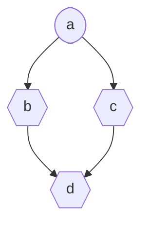

# Feature: Add DependencyGraph Module for Assigner

> **Depends on #8** - This PR should be merged after #8 is merged.

## 📋 Summary

Add a `DependencyGraph` module that provides advanced dependency management capabilities for the assigner system, including cyclic dependency detection at registration time.

## ✨ Features

### 1. Cyclic Dependency Detection

Automatically detects cyclic dependencies when registering assigners:

```python
class MyAssigner(AssignerBase):
    @assigner(assigned_fields=["b"], dependent_fields=["a"], mode="auto")
    def calc_b(dep): ...
    
    @assigner(assigned_fields=["c"], dependent_fields=["b"], mode="auto")
    def calc_c(dep): ...
    
    # This will raise CyclicDependencyError!
    @assigner(assigned_fields=["a"], dependent_fields=["c"], mode="auto")
    def calc_a(dep): ...  # a → b → c → a forms a cycle
```

### 2. DependencyGraph API

| Method | Description |
|--------|-------------|
| `validate()` | Check for cyclic dependencies |
| `get_topological_order()` | Get all fields in computation order |
| `get_execution_order(field)` | Get fields needed to compute target |
| `get_affected_fields(field)` | Get fields affected by a change |
| `get_all_dependencies(field)` | Get all dependencies (direct + indirect) |
| `mark_dirty(field)` | Mark field as needing recomputation |
| `is_dirty(field)` | Check if field needs recomputation |
| `visualize()` | Generate Mermaid flowchart |

### 3. AssignerExecutor

A helper class for managed computation with dirty tracking:

```python
graph = DependencyGraph()
# ... register fields ...

executor = AssignerExecutor(graph)
executor.set_value("a", 10)
result = executor.compute("d")  # Computes all dependencies automatically
```

### 4. Mermaid Visualization

```python
graph = assigner_cls.get_dependency_graph()
print(graph.visualize())
```

Output:


## 🔧 Integration with AssignerBase

- `DependencyGraph` is automatically created and maintained when using `@assigner`
- Cyclic dependencies are detected at registration time (fail fast)
- `assign()` method uses the graph for execution order when available
- New `get_dependency_graph()` class method for advanced operations

## 🧪 Tests

Added `tests/test_dependency_graph.py` with 10 tests covering:
- Registration and validation
- Cyclic dependency detection
- Topological ordering
- Execution order calculation
- Affected fields calculation
- Dependency collection
- Mermaid visualization
- Integration with AssignerBase
- AssignerExecutor computation
- Dirty tracking

All 220 tests pass.

## 📝 Files Changed

- `src/airalogy/assigner/assigner_base.py` - Integrate DependencyGraph
- `src/airalogy/assigner/dependency_graph.py` - New module (already added in #8)
- `src/airalogy/assigner/__init__.py` - Export new classes
- `tests/test_dependency_graph.py` - New tests

## 🔄 Backward Compatibility

Fully backward compatible. Existing code continues to work unchanged. The new features are opt-in.
