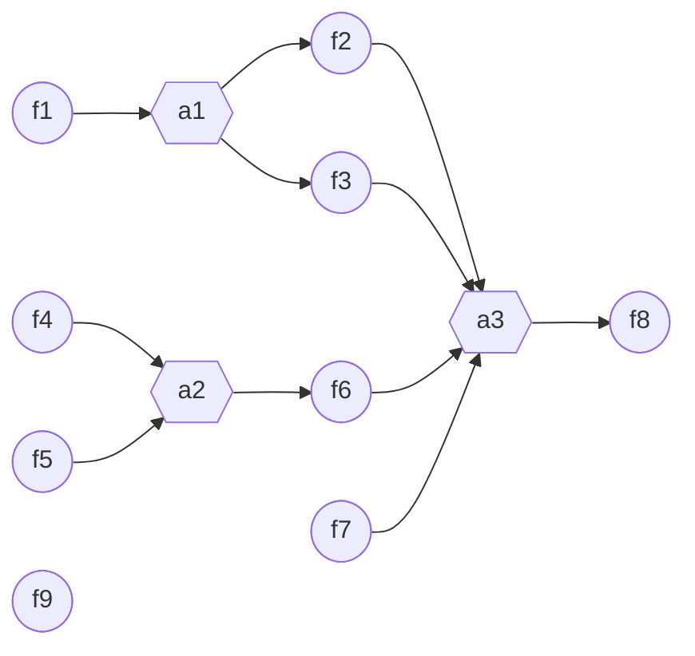

# Assigner Syntax

## 1 What Is an *Assigner*?

In many research protocols, the value of one field can be **computed automatically** from other fields—for example, a variable (`var`), a step (`step`), or a checkpoint (`check`).
Airalogy offers a high-level feature called an **Assigner** to describe and execute these dependencies.

### 1.1 Typical Use Case

Suppose `var_3` should always equal `var_1 + var_2`.
There are two common ways to define protocol fields (including types):

1. **Classic 3-file style (most complete)**: `protocol.aimd` + `model.py` + `assigner.py`. Use this when you need advanced typing/validation (e.g., richer constraints in Pydantic).
2. **2-file style (simpler, covers most cases)**: use typed AIMD to put types directly in `protocol.aimd`, plus `assigner.py`.

Typed AIMD syntax: [Using Types in Airalogy Markdown](./aimd-with-type.md).

Below shows the same assigner logic in both styles. For brevity, the rest of this page uses the **2-file typed AIMD** style.

#### Style A: Classic 3-file (`protocol.aimd` + `model.py` + `assigner.py`)

**File 1: `protocol.aimd`**

```aimd
The value of `var_1`: {{var|var_1}}
The value of `var_2`: {{var|var_2}}
The value of `var_3`: {{var|var_3}}

Note: `var_3` = `var_1` + `var_2`
```

**File 2: `model.py`**

```python
from pydantic import BaseModel

class VarModel(BaseModel):
    var_1: int
    var_2: int
    var_3: int
```

**File 3: `assigner.py`**

```python
from airalogy.assigner import AssignerResult, assigner

@assigner(
    assigned_fields=["var_3"],  # fields to assign
    dependent_fields=["var_1", "var_2"],  # fields that this function depends on
    mode="auto",  # See "Assigner Modes" below
)
def calculate_var_3(dependent_fields: dict) -> AssignerResult:
    v1 = dependent_fields["var_1"]
    v2 = dependent_fields["var_2"]
    v3 = v1 + v2

    return AssignerResult(
        assigned_fields={"var_3": v3}
    )
```

Note: `success` and `error_message` are optional. When omitted, `success` defaults to `True` and `error_message` defaults to `None`:

```python
return AssignerResult(
    assigned_fields={"var_3": v3}
)
```

#### Style B: 2-file (typed AIMD + `assigner.py`)

**File 1: typed `protocol.aimd`**

```aimd
The value of `var_1`: {{var|var_1: int}}
The value of `var_2`: {{var|var_2: int}}
The value of `var_3`: {{var|var_3: int}}

Note: `var_3` = `var_1` + `var_2`
```

**File 2: `assigner.py`** (same as Style A)

> **Many-to-many is allowed**
> An Assigner can read *any* number of fields and assign *any* number of fields—across `var`, `step`, and `check` alike.

### 1.2 Real-world Example: Solution Preparation

In real-world research data recording, many values are derived from other fields. A typical example is preparing a solution with a target concentration: given the target volume, target molar concentration, and the solute molar mass, the required solute mass can be computed automatically.

#### Typed `protocol.aimd`

```aimd
Solvent name: {{var|solvent_name: str}}
Target solution volume (L): {{var|target_solution_volume: float, gt=0}}
Solute name: {{var|solute_name: str}}
Solute molar mass (g/mol): {{var|solute_molar_mass: float, gt=0}}
Target molar concentration (mol/L): {{var|target_molar_concentration: float, gt=0}}
Required solute mass (g): {{var|required_solute_mass: float, gt=0}}
```

#### `assigner.py`

```python
from airalogy.assigner import AssignerResult, assigner

@assigner(
    assigned_fields=["required_solute_mass"],
    dependent_fields=[
        "target_solution_volume",
        "solute_molar_mass",
        "target_molar_concentration",
    ],
    mode="auto",
)
def calculate_required_solute_mass(dep: dict) -> AssignerResult:
    v = dep["target_solution_volume"]
    mm = dep["solute_molar_mass"]
    c = dep["target_molar_concentration"]
    return AssignerResult(
        assigned_fields={"required_solute_mass": v * c * mm},
    )
```

If you need more advanced typing/validation (custom Pydantic models, cross-field validation, etc.), use the classic 3-file style with `model.py`.

### 1.3 Extensibility Notes

The computation inside an Assigner can be anything you can express in Python: pure Python logic, third-party packages, API calls, or AI services. In practice, prefer deterministic and fast computations, and handle failures by returning `success=False` with an `error_message`.


## 2 Assigner Modes

The `mode` affects **when** the Assigner is triggered, and whether it is expected to be **user-editable** after assignment.

- `"auto"`: run whenever dependencies change, and **overwrite** the assigned field value with the new result.
- `"manual"`: do **not** auto-run; user must click an "Assign" button in the UI. Use this if you don't want auto-trigger on every dependency change.
- `"auto_first"`: run automatically **once** (typically when dependencies become available), then stop auto-refresh; behavior-wise you can think of it as “auto once, then like `manual` (needs a manual trigger to run again)”.
- `"auto_readonly"`: same as `"auto"`, but UI should lock assigned fields after filling.
- `"manual_readonly"`: same as `"manual"`, but UI should lock assigned fields after filling.

### What does “trigger” mean?

“Trigger” means: the platform continuously monitors field readiness, and when an Assigner’s dependencies become ready (and change, or become available for the first time), it executes the Assigner function and writes results into its `assigned_fields`.

- In `mode="auto"`: dependency changes (with all dependencies ready) trigger recomputation; assigned fields can then trigger downstream assigners, enabling **multi-level auto assignment**.
- In `mode="auto_first"`: it triggers once when dependencies first become ready, then stops auto-refresh.
- In `mode="manual"`: it does not auto-trigger; users must click a button in the UI to run it.

## 3 `dependent_fields` and `assigned_fields`

- Both are plain Python **dicts** whose keys are field names.
- Values follow the JSON Schema of the protocol; i.e. only JSON-serialisable types.
- For special field classes (e.g. a checkpoint) you may need to wrap the value in a helper model such as `CheckValue`.

## 4 Airalogy Field Dependency Graph (Advanced)

In complex research recording scenarios, the assignment relationships between Airalogy Fields can be **multi-level** and **multi-dependency**.
To support this, the runtime constructs a directed dependency graph between fields, called the **Airalogy Field Dependency Graph**.
It represents all field assignment relationships within a protocol, allowing the runtime to track which fields are ready and trigger assigners accordingly.

Most users don't need to think about this graph explicitly—just declare `dependent_fields` and `assigned_fields` correctly, and keep the constraints below.

### 4.1 Constraints

To keep assignment deterministic and well-defined, the dependency graph must satisfy:

1. It must be a **Directed Acyclic Graph (DAG)** (no cycles).
2. Each Airalogy Field can be assigned by **at most one** assigner function.

### 4.2 Example: Multi-level and Multi-dependency Assigners

The following protocol contains nine fields (`f1`–`f9`) and three assigners (`a1`–`a3`):

#### Typed `protocol.aimd` (replaces `protocol.aimd` + `model.py`)

```aimd
Number F1: {{var|f1: int}}
Number F2 (= F1 + 1): {{var|f2: int}}
Number F3 (= F1 × 2): {{var|f3: int}}
Number F4: {{var|f4: int}}
Number F5: {{var|f5: int}}
Number F6 (= F4 × F5): {{var|f6: int}}
Number F7: {{var|f7: int}}
Number F8 (= F2 + F3 + F6 + F7): {{var|f8: int}}
Number F9: {{var|f9: int}}
```

Their dependencies look like the following diagram:



#### `assigner.py`

```python
from airalogy.assigner import AssignerResult, assigner

@assigner(
    assigned_fields=["f2", "f3"],
    dependent_fields=["f1"],
    mode="auto",
)
def a1(dependent_fields: dict) -> AssignerResult:
    f1 = dependent_fields["f1"]
    return AssignerResult(
        assigned_fields={"f2": f1 + 1, "f3": f1 * 2},
    )

@assigner(
    assigned_fields=["f6"],
    dependent_fields=["f4", "f5"],
    mode="auto",
)
def a2(dependent_fields: dict) -> AssignerResult:
    f4 = dependent_fields["f4"]
    f5 = dependent_fields["f5"]
    return AssignerResult(
        assigned_fields={"f6": f4 * f5},
    )

@assigner(
    assigned_fields=["f8"],
    dependent_fields=["f2", "f3", "f6", "f7"],
    mode="auto",
)
def a3(dependent_fields: dict) -> AssignerResult:
    f2 = dependent_fields["f2"]
    f3 = dependent_fields["f3"]
    f6 = dependent_fields["f6"]
    f7 = dependent_fields["f7"]
    return AssignerResult(
        assigned_fields={"f8": f2 + f3 + f6 + f7},
    )
```

### 4.3 Example Run: Entering Fields in Order `f1` → `f9`

Suppose the user enters values in the recording UI in the order `f1` to `f9`. The runtime triggers assigners when dependencies become available (see “What does trigger mean?”):

1. Fill `f1` → triggers `a1` → assigns `f2` and `f3`.
2. Fill `f4` → `a2` is still waiting for `f5`.
3. Fill `f5` → triggers `a2` → assigns `f6`.
4. Fill `f7` → triggers `a3` (now `f2`, `f3`, `f6`, `f7` are ready) → assigns `f8`.
5. Fill `f9` → all fields are ready; the record can be submitted.

## 5 Working with Complex Types

If a field stores a complex type (e.g. `datetime`) it is transmitted as a JSON-compatible value (usually a string).
Convert it to a native Python object before calculation, then convert back:

```python
from datetime import datetime, timedelta
from airalogy.assigner import AssignerResult, assigner

@assigner(
    assigned_fields=["record_time_plus_1_day"],
    dependent_fields=["record_time"],
    mode="auto",
)
def plus_one_day(dep: dict) -> AssignerResult:
    # JSON → Python
    t0 = datetime.fromisoformat(dep["record_time"])

    t1 = t0 + timedelta(days=1)

    # Python → JSON
    return AssignerResult(
        assigned_fields={
            "record_time_plus_1_day": t1.isoformat()
        }
    )
```

## 6 Assigners for Checkpoints

Checkpoints (`check`) can be calculated the same way, but you must return a `CheckValue`:

```python
from airalogy.assigner import AssignerResult, assigner
from airalogy.models import CheckValue

@assigner(
    assigned_fields=["var_1_2_sum", "check_sum_gt_10"],
    dependent_fields=["var_1", "var_2"],
    mode="auto",
)
def check_sum(dep: dict) -> AssignerResult:
    v1 = dep["var_1"]
    v2 = dep["var_2"]
    total = v1 + v2
    passed = total > 10

    return AssignerResult(
        assigned_fields={
            "var_1_2_sum": total,
            "check_sum_gt_10": CheckValue(
                checked=passed,
                annotation=f"var_1 + var_2 = {total} ({'>' if passed else '<='} 10)"
            )
        }
    )
```

> The same pattern works for `step` fields—return the helper model `StepValue`.

## Reference

| Decorator Argument | Description |
| - | - |
| `assigned_fields` | List of field names the function assigns |
| `dependent_fields` | List of field names the function depends on |
| `mode` | `"auto"` (run on change + overwrite), `"manual"` (button click), `"auto_first"` (run once), `"auto_readonly"` (auto + lock), or `"manual_readonly"` (manual + lock) |

### `AssignerResult`

| Field | Type | Default | Meaning |
| - | - | - | - |
| `success` | `bool` | `True` | Whether the assignment succeeded |
| `assigned_fields` | `dict[str, Any]` | **required** | New values |
| `error_message` | `str \| None` | `None` | Reason when `success` is `False` |

## Other Assigners

- [Variable Table Assigners](./var_table.md)

## Legacy Class Syntax (To Be Deprecated)

Older versions required an explicit `class Assigner(AssignerBase)` with static methods. This style is still supported for backward compatibility but will be removed in a future release, so please migrate new code to the function-based API shown earlier.

```python
from airalogy.assigner import AssignerBase, AssignerResult, assigner

class Assigner(AssignerBase):
    @assigner(
        assigned_fields=["var_3"],
        dependent_fields=["var_1", "var_2"],
        mode="auto",
    )
    def calculate_var_3(dependent_fields: dict) -> AssignerResult:
        return AssignerResult(
            assigned_fields={"var_3": dependent_fields["var_1"] + dependent_fields["var_2"]}
        )
```

> ⚠️ New development should **not** add more class-based Assigners unless absolutely necessary for legacy interoperability.
