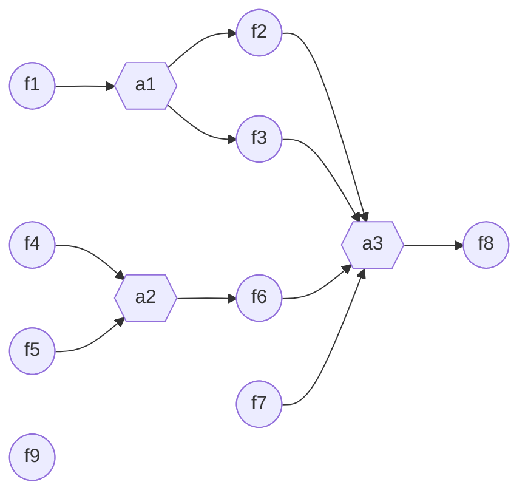

# Assigner 语法

## 什么是 Assigner？

在真实的科研方案中，有很多数据字段（比如`var`、`step`、`check`）是可以通过其他字段计算得到的（也即存在字段依赖关系）。为了满足这种依赖的自动计算，Airalogy提供了高级功能/语法：赋值器（Assigner）。

关于“如何定义字段（含类型）”，Assigner通常有三种写法：

- **经典3文件写法（最基础、最完整）**：`protocol.aimd` + `model.py` + `assigner.py`。当你需要更精细的类型、校验、默认值、跨字段约束时，建议使用这种方式。
- **2文件写法（更简单，覆盖大多数场景）**：使用 typed AIMD 把类型直接写进 `protocol.aimd`，再配合 `assigner.py`。大多数普通用户用这个就足够了。
- **单文件写法（最轻量）**：仅 `protocol.aimd`，把 Assigner 写在标记为 `assigner` 的代码块内。适合简单计算或快速原型。

typed AIMD 语法详见：[在Airalogy Markdown中使用类型](./aimd-with-type.md)。

下面用同一个“`var_3 = var_1 + var_2`”的Assigner逻辑，展示三种等价写法。

### 写法A：经典3文件（`protocol.aimd` + `model.py` + `assigner.py`）

**文件1：`protocol.aimd`**

```aimd
`var_1` 的值：{{var|var_1}}
`var_2` 的值：{{var|var_2}}
`var_3` 的值：{{var|var_3}}

注：`var_3` = `var_1` + `var_2`
```

**文件2：`model.py`**

```py
from pydantic import BaseModel

class VarModel(BaseModel):
    var_1: int
    var_2: int
    var_3: int
```

**文件3：`assigner.py`**

```py
# 文件：assigner.py

# 首先，我们从`airalogy`中的相关模块导入必要的类和函数
from airalogy.assigner import (
    AssignerResult, # 用于约束Assigner的返回结果的数据结构
    assigner, # 用于定义Assigner的装饰器
)

@assigner( # 被该装饰器装饰的函数会自动注册到一个默认的Assigner中
    assigned_fields=[ # 所赋值字段的名称
        "var_3",
    ],
    dependent_fields=[ # 依赖字段的名称
        "var_1",
        "var_2",
    ],
    mode="auto", # 用于定义Assigner的模式（见下文“Assigner模式”小节）
)
def calculate_var_3(dependent_fields: dict) -> AssignerResult: # 赋值函数的函数名可以任意命名，但其接收的参数必须为`dependent_fields`，且返回值必须为一个AssignerResult对象。其中`dependent_fields`字典必须包含所有依赖字段的值（即`dependent_fields`中的key-value对应于字段的名称和值，且必须一一对应）
    var_1_value = dependent_fields["var_1"] # 从`dependent_fields`字典中取出`var_1`的值
    var_2_value = dependent_fields["var_2"] # 从`dependent_fields`字典中取出`var_2`的值
    
    var_3_value = var_1_value + var_2_value # 计算`var_3`的值

    # 该函数的返回值为一个AssignerResult对象，其中包含了Assigner的执行结果
    return AssignerResult(
        success=True, # 用于表示Assigner是否成功执行
        assigned_fields={ # 用于表示Assigner执行成功后，所赋值字段的名称和值。该字典中的keys对应于被赋值字段的名称，且必须一一对应
            "var_3": var_3_value,
        },
        error_message=None, # 当Assigner执行失败时，用于表示失败的原因。由于此时`success`为True，因此该字段必须为None
    )

```

注：在上述Assigner的返回中，`success`和`error_message`也可以省略，此时`success`默认为`True`，`error_message`默认为`None`。则返回可以简化为：

```py
return AssignerResult(
    assigned_fields={
        "var_3": var_3_value,
    },
)
```

### 写法B：2文件（typed AIMD + `assigner.py`）

**文件1：typed AIMD（`protocol.aimd`）**

```aimd
`var_1` 的值：{{var|var_1: int}}
`var_2` 的值：{{var|var_2: int}}
`var_3` 的值：{{var|var_3: int}}

注：`var_3` = `var_1` + `var_2`
```

**文件2：`assigner.py`**（与写法A相同）

注意：

- 在上述案例中我们展示了从2个字段计算得到1个字段的情况。实际上，Assigner支持从任意多个字段计算得到任意多个字段，即被赋值字段和依赖字段的关系可以为多对多（multiple-to-multiple）。
- 在真实 Airalogy Protocol 中，Assigner的`dependent_fields`也可以是`check`或`step`。

### 写法C：单文件（AIMD + 内联 Assigner 代码块）

**文件1：`protocol.aimd`**

````aimd
`var_1` 的值：{{var|var_1: int}}
`var_2` 的值：{{var|var_2: int}}
`var_3` 的值：{{var|var_3: int}}

注：`var_3` = `var_1` + `var_2`

```assigner
from airalogy.assigner import AssignerResult, assigner

@assigner(
    assigned_fields=["var_3"],
    dependent_fields=["var_1", "var_2"],
    mode="auto",
)
def calculate_var_3(dep: dict) -> AssignerResult:
    return AssignerResult(
        assigned_fields={"var_3": dep["var_1"] + dep["var_2"]},
    )
```
````

在 Python 侧可以直接加载该 AIMD 中的内联 Assigner：

```py
from airalogy.assigner import load_inline_assigners

with open("protocol.aimd", "r", encoding="utf-8") as f:
    load_inline_assigners(f.read())
```

约束：**内联 Assigner 与 `assigner.py` 不可混用**。如果同一协议目录下存在 `assigner.py`，则 AIMD 内联的 `assigner` 代码块会被视为非法。

建议：

- `assigner` 代码块按 **Python** 语法编写，可被视为一个普通的 `.py` 文件片段。
- 建议只写 **一个** `assigner` 代码块，并放在 AIMD 末尾，方便阅读与抽取。

注：内联 Assigner 仍是完整的 Python 代码，适合轻量、确定性计算；复杂依赖或外部服务调用建议继续使用 `assigner.py`。

### 真实示例：配液计算（自动计算所需溶质质量）

在真实科研数据记录中，很多值都可以通过其他字段计算得到。一个常见例子是配制目标浓度的溶液：已知目标体积、目标摩尔浓度和溶质摩尔质量后，就可以自动计算“所需溶质质量”，从而减少手动计算与录入错误。

**typed AIMD（`protocol.aimd`）**

```aimd
溶剂名称：{{var|solvent_name: str}}
目标溶液体积（L）：{{var|target_solution_volume: float, gt=0}}
溶质名称：{{var|solute_name: str}}
溶质摩尔质量（g/mol）：{{var|solute_molar_mass: float, gt=0}}
目标摩尔浓度（mol/L）：{{var|target_molar_concentration: float, gt=0}}
所需溶质质量（g）：{{var|required_solute_mass: float, gt=0}}
```

**Assigner（`assigner.py`）**

```py
from airalogy.assigner import AssignerResult, assigner

@assigner(
    assigned_fields=["required_solute_mass"],
    dependent_fields=[
        "target_solution_volume",
        "solute_molar_mass",
        "target_molar_concentration",
    ],
    mode="auto",
)
def calculate_required_solute_mass(dep: dict) -> AssignerResult:
    v = dep["target_solution_volume"]
    mm = dep["solute_molar_mass"]
    c = dep["target_molar_concentration"]
    return AssignerResult(
        assigned_fields={"required_solute_mass": v * c * mm},
    )
```

如果你需要更高级的类型/校验（自定义 Pydantic 模型、跨字段校验等），建议使用经典3文件写法并在`model.py`中实现。

### 可扩展性说明

Assigner 里的计算逻辑原则上可以是任何 Python 能实现的内容：纯 Python 逻辑、第三方包、API 调用、甚至 AI 服务等。实际使用中建议尽量保持计算确定且快速，并在失败时返回 `success=False` 和 `error_message` 以便前端提示。

为了叙述简洁，本文后续示例默认采用 **2文件写法（typed AIMD + assigner.py）**。

## Assigner模式

`mode` 会影响 Assigner 的**触发时机**，以及被赋值字段在赋值后是否应允许用户继续编辑（由前端/执行器实现交互策略）。

- `"auto"`：当依赖字段发生变化时自动触发，并**强制覆写**被赋值字段的当前值。
- `"manual"`：不自动触发；需要用户在前端点击“Assign/赋值”按钮才执行。如果不希望依赖字段每次变化都触发，建议使用该模式。
- `"auto_first"`：自动触发**一次**（通常是依赖字段首次齐备时），之后不再自动刷新；触发行为上可理解为“先自动执行一次，后续等价于 `manual`（需要手动触发才会再次执行）”。
- `"auto_readonly"`：与 `"auto"` 相同，但一旦赋值后前端应禁止用户手动修改被赋值字段。
- `"manual_readonly"`：与 `"manual"` 相同，但一旦赋值后前端应禁止用户手动修改被赋值字段。

### 什么是“触发”（Trigger）？

这里的“触发”指：平台在记录界面持续监听字段状态，当某个 Assigner 的所有依赖字段都已就绪（并且依赖值发生变化或首次齐备）时，自动执行该 Assigner 的计算函数，并把结果写入其 `assigned_fields`。

- 在 `mode="auto"` 下：只要依赖字段的值变化且依赖齐备，就会触发并自动更新被赋值字段；如果这些被赋值字段又是其他 Assigner 的依赖字段，就会进一步触发下游 Assigner，从而实现**多级依赖的自动串联**。
- 在 `mode="auto_first"` 下：依赖首次齐备时会触发一次，之后不再随依赖变化自动触发。
- 在 `mode="manual"` 下：平台不会自动触发，需要用户在前端点击按钮才执行。

### `dependent_fields`/`assigned_fields`的数据结构

如前所示，在每被`@assigner`装饰的赋值函数中，其参数总是`dependent_fields`，并且其返还值`AssignerResult`中总是包含`assigned_fields`。那么`dependent_fields`/`assigned_fields`的数据结构是什么呢？为了保证通信的通用性，这里我们遵从以下规则：

1. `dependent_fields`/`assigned_fields`的本质可以被视为是一个API请求的JSON数据结构，其通信协议遵循Airalogy Protocol Model的JSON Schema。
2. `dependent_fields`/`assigned_fields`是一个Python字典（`dict`），其key为Fields的名称，其value为Fields的值。
3. key总是一个字符串。
4. value的数据类型根据字段的 JSON Schema（可在 Airalogy Record 记录界面左侧字段列表中查看）而定。换言之，value 的数据类型总是 JSON Schema 支持的数据类型，只不过由于 Assigner 在 Python 中运行，因此这些字段的数据类型是从 JSON Schema 转换为 Python 后的等价数据类型。
5. 对于`assigned_fields`而言，由于某些特殊的Assigner（如`check`）其所需返还的字段可能存在特殊的数据结构，在这些情况下，可能需要通过`airalogy`中特定的数据类型进行返还约束（如`CheckValue`）。

## 进阶：复杂依赖（字段依赖图）

这一部分属于进阶概念：大多数情况下你不需要理解内部的“图”，只要按`dependent_fields`/`assigned_fields`写清楚依赖关系即可，平台会自动跟踪依赖是否齐备并触发赋值。

为了保证行为可预测，字段之间的依赖关系需要满足两个约束（你真正需要关心的点）：

1. 依赖关系不能形成循环（即整体是一个有向无环图，DAG）。
2. 每个字段最多只能被一个Assigner函数赋值（避免多个规则同时写同一个字段）。

### 示例：多级依赖 + 多重依赖

下面是一个多级依赖的例子（9个字段：`f1`–`f9`；3个Assigner：`a1`–`a3`）。这里用 typed AIMD 来定义字段与类型：

```aimd
Number F1: {{var|f1: int}}
Number F2 (= F1 + 1): {{var|f2: int}}
Number F3 (= F1 × 2): {{var|f3: int}}
Number F4: {{var|f4: int}}
Number F5: {{var|f5: int}}
Number F6 (= F4 × F5): {{var|f6: int}}
Number F7: {{var|f7: int}}
Number F8 (= F2 + F3 + F6 + F7): {{var|f8: int}}
Number F9: {{var|f9: int}}
```

它们的依赖关系类似如下图所示：



对应的`assigner.py`如下：

```py
from airalogy.assigner import AssignerResult, assigner

@assigner(
    assigned_fields=["f2", "f3"],
    dependent_fields=["f1"],
    mode="auto",
)
def a1(dependent_fields: dict) -> AssignerResult:
    f1 = dependent_fields["f1"]
    return AssignerResult(
        assigned_fields={"f2": f1 + 1, "f3": f1 * 2},
    )

@assigner(
    assigned_fields=["f6"],
    dependent_fields=["f4", "f5"],
    mode="auto",
)
def a2(dependent_fields: dict) -> AssignerResult:
    f4 = dependent_fields["f4"]
    f5 = dependent_fields["f5"]
    return AssignerResult(
        assigned_fields={"f6": f4 * f5},
    )

@assigner(
    assigned_fields=["f8"],
    dependent_fields=["f2", "f3", "f6", "f7"],
    mode="auto",
)
def a3(dependent_fields: dict) -> AssignerResult:
    f2 = dependent_fields["f2"]
    f3 = dependent_fields["f3"]
    f6 = dependent_fields["f6"]
    f7 = dependent_fields["f7"]
    return AssignerResult(
        assigned_fields={"f8": f2 + f3 + f6 + f7},
    )
```

如果用户按`f1`→`f9`的顺序输入，那么平台会在“字段就绪”时自动触发相关Assigner（见上文“什么是触发”），大致流程是：

1. 输入`f1`后触发`a1`，自动得到`f2`、`f3`。
2. 输入`f4`时`a2`还不会触发（因为`f5`未就绪）。
3. 输入`f5`后触发`a2`，自动得到`f6`。
4. 输入`f7`后`a3`依赖全部就绪，触发`a3`，自动得到`f8`。
5. 输入`f9`后所有字段均已就绪，记录可提交。

### 含有复杂数据类型的Assigner

当`dependent_fields`中含有具有复杂数据类型的`var`s时，如果我们需要在Assigner中对其进行基于复杂类型的计算，我们应该显式的将其从简单数据类型转换为复杂数据类型。

例如，

**文件1：typed AIMD（`protocol.aimd`）**

```aimd
实验记录时间：{{var|record_time: datetime}}
实验记录时间+1天：{{var|record_time_plus_1_day: datetime}}
```

**文件2：Assigner（`assigner.py`）**

```py
# 文件：assigner.py

from datetime import datetime, timedelta
from airalogy.assigner import AssignerResult, assigner

@assigner(
    assigned_fields=[
        "record_time_plus_1_day",
    ],
    dependent_fields=[
        "record_time",
    ],
    mode="auto",
)
def calculate_record_time_plus_1_day(dependent_fields: dict) -> AssignerResult:
    record_time_str = dependent_fields["record_time"] # datetime类型在JSON Schema中储存为字符串
    record_time = datetime.fromisoformat(record_time_str) # 将字符串转换为datetime类型

    record_time_plus_1_day = record_time + timedelta(days=1)
    record_time_plus_1_day_str = record_time_plus_1_day.isoformat() # 将datetime类型转换为字符串以保证通信可行性

    return AssignerResult(
        assigned_fields={
            "record_time_plus_1_day": record_time_plus_1_day_str,
        },
    )
```

## 用 Assigner 计算 Checkpoint 类字段

在真实的科研方案中，有很多`check`是可以通过其他字段计算得到的。为了满足这种依赖的自动计算，也可以使用 Assigner 来实现。

例如，`check_1`可以基于`var_1`和`var_2`的值来自动计算获得。对于该实例，我们可以通过编写以下2个文件来实现：

**文件1：typed AIMD（`protocol.aimd`）**。在该文件中，我们显式定义`var_1`、`var_2`、`var_1_2_sum`、`check_sum_gt_10`及其类型（其中`check`字段本身不需要额外类型标注）。

```aimd
<!-- 文件：protocol.aimd -->

`var_1` 的整数值：{{var|var_1: int}}

`var_2` 的整数值：{{var|var_2: int}}

`var_1` 与 `var_2` 的和：{{var|var_1_2_sum: int}}

{{rc|check_sum_gt_10}} `var_1` + `var_2` > 10

注：若 `var_1` + `var_2` > 10，则 `check_sum_gt_10.checked` = `True`；否则 `check_sum_gt_10.checked` = `False`
```

**文件2：Assigner（`assigner.py`）**。在该文件中，我们定义了`check_sum_gt_10`的计算逻辑。

```py
# 文件：assigner.py

from airalogy.assigner import AssignerResult, assigner
from airalogy.models import CheckValue # 用于约束`check`的值的数据类型

@assigner(
    assigned_fields=[
        "var_1_2_sum", # 注意这里被赋值的是一个`var`
        "check_sum_gt_10", # 注意这里被赋值的是一个`check`
    ],
    dependent_fields=[
        "var_1",
        "var_2",
    ],
    mode="auto",
)
def check_sum_gt_10(dependent_fields: dict) -> AssignerResult:
    var_1_value = dependent_fields["var_1"]
    var_2_value = dependent_fields["var_2"]

    var_1_2_sum = var_1_value + var_2_value
    check_sum_gt_10_checked = var_1_2_sum > 10

    return AssignerResult(
        assigned_fields={
            "var_1_2_sum": var_1_2_sum,
            "check_sum_gt_10": CheckValue( # 由于`check`的值有特殊的数据结构，即包含`checked`和`annotation`两个字段，因此在赋值时需要使用`CheckValue`类对数据结构进行约束
                checked=check_sum_gt_10_checked, 
                annotation=f"var_1 + var_2 = {var_1_2_sum}（{'>' if check_sum_gt_10_checked else '<='} 10）"
            )
        },
    )
```

注：`step`也可以通过Assigner进行自动计算，其方法与`check`类似。

## 其他Assigner

- [Variable Table 的 Assigner](var_table.md#assigner-for-variable-table)

## 旧版`Assigner`类语法（计划废弃）

在历史版本中，编写Assigner时必须手动定义`class Assigner(AssignerBase)`并把函数写成静态方法。该写法仍可在旧项目中使用，但将来会被完全移除，推荐尽快迁移到本文前面介绍的函数式语法。

```py
from airalogy.assigner import AssignerBase, AssignerResult, assigner

class Assigner(AssignerBase):
    @assigner(
        assigned_fields=["var_3"],
        dependent_fields=["var_1", "var_2"],
        mode="auto",
    )
    def calculate_var_3(dependent_fields: dict) -> AssignerResult:
        var_1_value = dependent_fields["var_1"]
        var_2_value = dependent_fields["var_2"]
        return AssignerResult(
            assigned_fields={"var_3": var_1_value + var_2_value},
        )
```

> ⚠️ 注意：新版的模块级函数语法具备同样的功能且更加简洁。若无特殊兼容性需求，请勿再新增此旧语法的代码。
